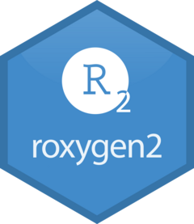

# roxygen2 

<!-- badges: start -->
[](https://CRAN.R-project.org/package=roxygen2)
[](https://github.com/r-lib/roxygen2/actions)
[](https://app.codecov.io/gh/r-lib/roxygen2?branch=main)
<!-- badges: end -->

The premise of roxygen2 is simple: describe your functions in comments next to their definitions and roxygen2 will process your source code and comments to automatically generate `.Rd` files in `man/`, `NAMESPACE`, and, if needed, the `Collate` field in `DESCRIPTION`.

## Installation 

```R
# Install devtools from CRAN
install.packages("roxygen2")

# Or the development version from GitHub:
# install.packages("devtools")
devtools::install_github("r-lib/roxygen2")
```

## Usage

The premise of roxygen2 is simple: describe your functions in comments next to their definitions and roxygen2 will process your source code and comments to produce Rd files in the `man/` directory.  Here's a [simple example](https://stringr.tidyverse.org/reference/str_length.html) from the stringr package:

```R
#' The length of a string
#'
#' Technically this returns the number of "code points", in a string. One
#' code point usually corresponds to one character, but not always. For example,
#' an u with a umlaut might be represented as a single character or as the
#' combination a u and an umlaut.
#'
#' @inheritParams str_detect
#' @return A numeric vector giving number of characters (code points) in each
#'    element of the character vector. Missing string have missing length.
#' @seealso [stringi::stri_length()] which this function wraps.
#' @export
#' @examples
#' str_length(letters)
#' str_length(NA)
#' str_length(factor("abc"))
#' str_length(c("i", "like", "programming", NA))
str_length <- function(string) {
}
```

When you `roxygenise()` (or `devtools::document()`) your package these comments will be automatically transformed to the `.Rd` that R uses to generate the documentation you see when you type `?str_length`. 

## Learn more

To get started, first read `vignette("roxygen2")`. Then read more about the specific package component that you want to generate:

* Start with `vignette("rd")` to learn how document your functions with roxygen2.

* `vignette("rd-other")` discusses how to document other things like datasets, the package itself, and the various pieces used by R's OOP systems.

* `vignette("rd-formatting")` gives the details of roxygen2's rmarkdown support.

* `vignette("reuse")` demonstrates the tools available to reuse documentation in multiple places.

* `vignette("namespace")` describes how to generate a `NAMESPACE` file, how namespacing works in R, and how you can use roxygen2 to be specific about what your package needs and supplies.

* For the `Collate` field in the `DESCRIPTION`, see `?update_collate()`.
