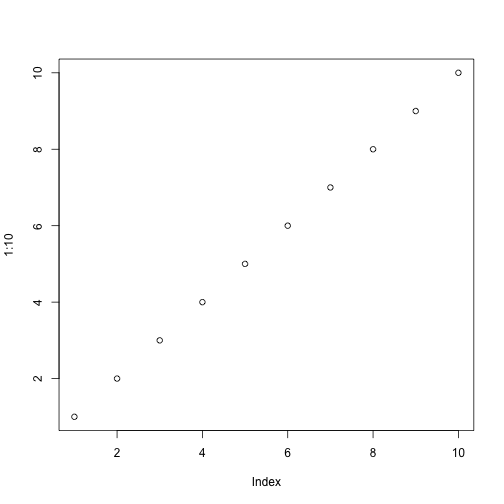

# Expand the embedded inline code

Expand the embedded inline code

## Usage

``` r
markdown_pass1(text)
```

## Arguments

- text:

  Input text.

## Value

Text with R code expanded. A character vector of the same length as the
input `text`.

## Details

For example this becomes two: 2. Variables can be set and then reused,
within the same tag: The value of `x` is 100.

We have access to the internal functions of the package, e.g. since this
is *roxygen2*, we can refer to the internal `markdown` function, and
this is `TRUE`: TRUE.

To insert the name of the current package: roxygen2.

The `iris` data set has 5 columns: `Sepal.Length`, `Sepal.Width`,
`Petal.Length`, `Petal.Width`, `Species`.

    # Code block demo
    x + 1
    #> [1] 101

Chunk options:

    names(mtcars)
    nrow(mtcars)
    #>  [1] "mpg"  "cyl"  "disp" "hp"   "drat" "wt"   "qsec" "vs"   "am"   "gear"
    #> [11] "carb"
    #> [1] 32

Plots:

    plot(1:10)



Alternative knitr engines:

    ```{r}
    # comment
    this <- 10
    is <- this + 10
    good <- this + is

Also see
[`vignette("rd-formatting")`](https://roxygen2.r-lib.org/dev/articles/rd-formatting.md).
